<picture>
  <source media="(prefers-color-scheme: dark)" srcset="https://raw.githubusercontent.com/musaJawad004/musaJawad004/main/dark.svg">
  <source media="(prefers-color-scheme: light)" srcset="https://raw.githubusercontent.com/musaJawad004/musaJawad004/main/light.svg">
  
</picture>

# Muhammad Musa

AI App Developer | Flutter & React Native | LLMs, AI Agents & Full Stack

<!--
  This card is generated by generate_profile.py and refreshed daily by
  .github/workflows/profile.yml. Edit CONFIG / ASCII_ART / INFO in the script,
  never the .svg files directly.
-->

## 🌐 Connect With Me:

## 💻 Tech Stack:
     
         
          
    
      
       
 

---

