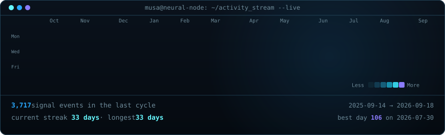

<picture>
  <source media="(prefers-color-scheme: dark)" srcset="https://raw.githubusercontent.com/musaJawad004/musaJawad004/dev/dark.svg?v=7">
  <source media="(prefers-color-scheme: light)" srcset="https://raw.githubusercontent.com/musaJawad004/musaJawad004/dev/light.svg?v=7">
  
</picture>

[`PORTFOLIO`](https://musadev.vercel.app/) &nbsp; [`GITHUB`](https://github.com/musaJawad004) &nbsp; [`LINKEDIN`](https://www.linkedin.com/in/muhammadmusadev/) &nbsp; [`EMAIL`](mailto:musaJawad004@gmail.com)

<!--
  All panels are generated by generate_profile.py (fonts embedded from ./fonts)
  in the Nothing design system. Refreshed by .github/workflows/profile.yml.
  Edit CONFIG in the script, never the .svg files directly.
-->

<picture>
  <source media="(prefers-color-scheme: dark)" srcset="https://raw.githubusercontent.com/musaJawad004/musaJawad004/dev/status-dark.svg?v=2">
  <source media="(prefers-color-scheme: light)" srcset="https://raw.githubusercontent.com/musaJawad004/musaJawad004/dev/status-light.svg?v=2">
  
</picture>

## ~/about

- 🤖 **AI Engineer & Mobile App Developer** with **3 years** building AI apps that actually ship, not demos
- 🧠 I build **AI agents**, **RAG systems**, and **custom / fine-tuned LLMs** for real product features
- 📱 And ship them inside cross-platform apps with **Flutter** & **React Native** on **Node.js** backends
- 🚀 In 3 years: **10+ apps** live on iOS & Android &middot; **10k+ active users** &middot; **5+ custom LLMs** trained
- 💼 Currently **AI Engineer** at **Glixen Technologies**, taking AI features from idea to launched product
- 🎯 **Philosophy:** keep it simple, ship fast, keep it clean, build apps people actually use

## ~/now

- 🔭 Building **AI agents & RAG systems** inside production mobile apps at **Glixen Technologies**
- 🦙 Training & fine-tuning **custom LLMs** with **RunPod** and **Ollama** for real features
- 🧩 Designing **full-stack AI**: model &rarr; backend &rarr; mobile app
- 🌱 Going deeper on **agentic systems, LLM inference & vector search**

<picture>
  <source media="(prefers-color-scheme: dark)" srcset="https://raw.githubusercontent.com/musaJawad004/musaJawad004/dev/divider-dark.svg?v=2">
  <source media="(prefers-color-scheme: light)" srcset="https://raw.githubusercontent.com/musaJawad004/musaJawad004/dev/divider-light.svg?v=2">
  
</picture>

## ~/stack

<picture>
  <source media="(prefers-color-scheme: dark)" srcset="https://raw.githubusercontent.com/musaJawad004/musaJawad004/dev/stack-dark.svg?v=1">
  <source media="(prefers-color-scheme: light)" srcset="https://raw.githubusercontent.com/musaJawad004/musaJawad004/dev/stack-light.svg?v=1">
  
</picture>

<picture>
  <source media="(prefers-color-scheme: dark)" srcset="https://raw.githubusercontent.com/musaJawad004/musaJawad004/dev/divider-dark.svg?v=2">
  <source media="(prefers-color-scheme: light)" srcset="https://raw.githubusercontent.com/musaJawad004/musaJawad004/dev/divider-light.svg?v=2">
  
</picture>

## ~/achievements

<picture>
  <source media="(prefers-color-scheme: dark)" srcset="https://raw.githubusercontent.com/musaJawad004/musaJawad004/dev/achievements-dark.svg?v=2">
  <source media="(prefers-color-scheme: light)" srcset="https://raw.githubusercontent.com/musaJawad004/musaJawad004/dev/achievements-light.svg?v=2">
  
</picture>

<picture>
  <source media="(prefers-color-scheme: dark)" srcset="https://raw.githubusercontent.com/musaJawad004/musaJawad004/dev/divider-dark.svg?v=2">
  <source media="(prefers-color-scheme: light)" srcset="https://raw.githubusercontent.com/musaJawad004/musaJawad004/dev/divider-light.svg?v=2">
  
</picture>

## ~/github

 

---

